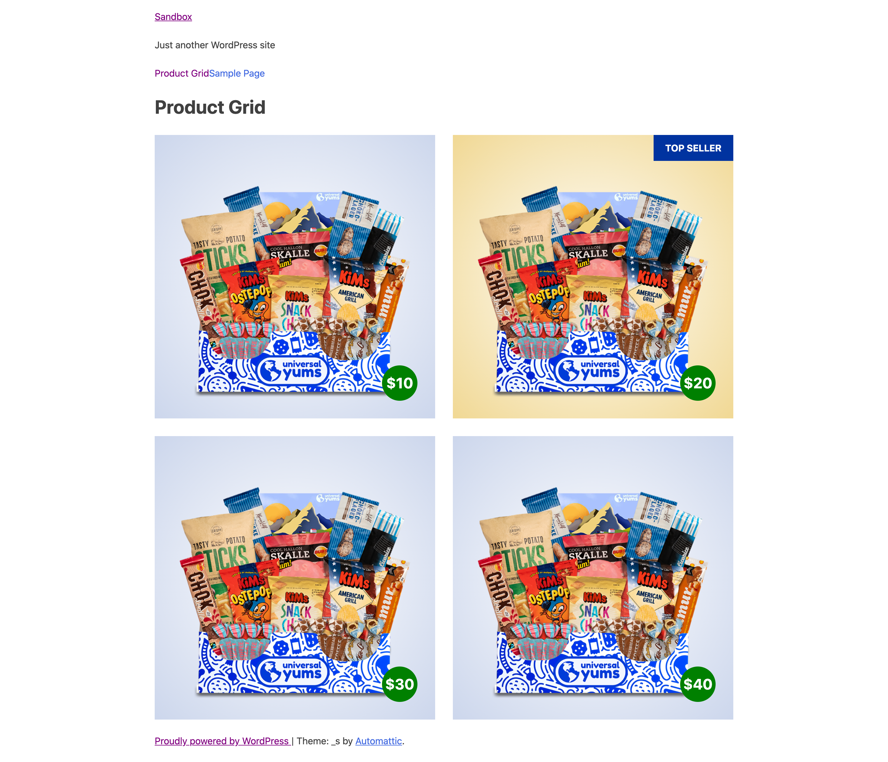

## Interview Project Front-End Developer

Hello! Thanks for taking the time to complete this project to help evaluate CSS and WordPress skills.

### Project instructions

1. Fork [the _s repository](https://github.com/Automattic/_s) (a theme maintained by Automattic) into your own account.

2. You will be building out a page template to display a product grid, which should look like this on a desktop screen when complete.



*Don't worry about getting all the colors and dimensions pixel perfect, we're just looking for a close representation.*

3. Set up a new page template called "Product Grid" with the default theme header and footer from _s.

4. We're looking to see how you implement different design details with CSS, so please use the following markup to display the grid.

```html
<div class="product-grid">
    <div>
        [Image: Replace this placeholder with code to output image]
        <div class="price">10</div>
    </div>
    <div>
        [Image: Replace this placeholder with code to output image]
        <div class="price">20</div>
    </div>
    <div>
        [Image: Replace this placeholder with code to output image]
        <div class="price">30</div>
    </div>
    <div>
        [Image: Replace this placeholder with code to output image]
        <div class="price">40</div>
    </div>
</div>
```

For the image, use WordPress functions to load the image path from the theme. The image [yum.png](yum.png) can be found in this repository.

You shouldn't need to add any classes or extra markup in order to display the product grid as shown in the above screenshot (aside from the markup for rendering the image).

5. Styles should be written in sass and compile the same way other scss files in the _s theme do.

6. The screenshot above shows how the grid should display on a larger desktop screens. Please use your best judgment when coding how it will display on smaller mobile screens.

7. Add some sort of fun animation or effect when the product square has a hover state.

8. Optimize the image rendering for efficient load times.